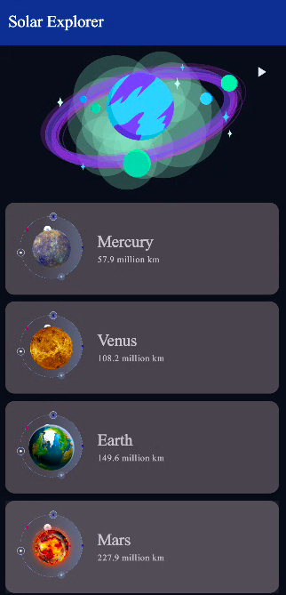
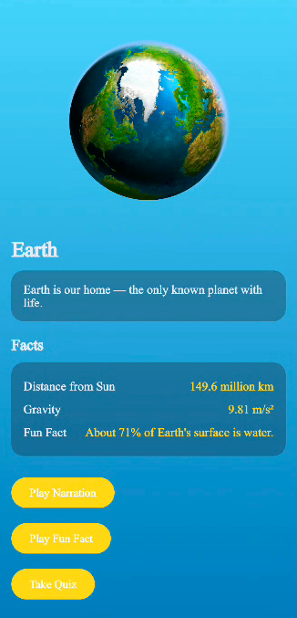
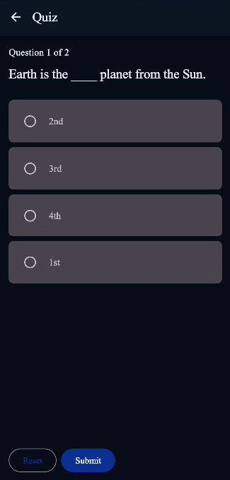
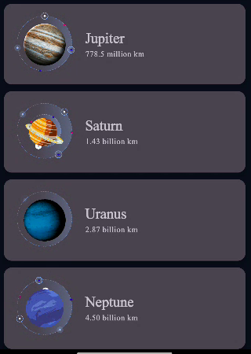

# 🌌 Solar Explorer — Learn the Solar System (Jetpack Compose)

A modern Android app built with **Jetpack Compose**, designed to teach users about the Solar System using animations, Text-to-Speech narration, quizzes, and an interactive tour experience.

---

## ✨ Features

### 🪐 Planet Learning
- Detailed information for every planet
- High-quality images & clean UI
- Smooth animations

### 🎧 Text-to-Speech Narration
- Auto-read explanations
- Adjustable playback
- Great for kids & learners

### ❓ Per-Planet Quiz
- 3–5 questions per planet
- Score tracking
- Fun learning activity

### 🚀 Guided Solar System Tour
- TTS-powered automatic tour
- Animations + transitions
- Learn the whole system hands-free

### ⚙️ Data Persistence with DataStore
- Saves quiz scores
- Saves TTS tour settings
- Works offline

### 🎞️ Lottie Animations
- Beautiful animated home banner
- Smooth Compose integration

---

## 📱 Screenshots

### 🏠 Home Screen

### 🌍 Planet Detail Screen

### ❓ Quiz Screen

### 🎧 TTS Tour Screen

---

## 🛠️ Tech Stack

- **Kotlin**
- **Jetpack Compose**
- **Material 3**
- **Lottie Compose**
- **ViewModel**
- **DataStore Preferences**
- **TTS (TextToSpeech API)**
- **Navigation Component**
- **Coroutines + Flow**

---

## 📦 Project Structure
app/
├── data/ 
│ ├── datastore/ 
│ └── model/ 
├── ui/ 
│ ├── home/ 
│ ├── detail/ 
│ ├── quiz/ 
│ ├── tour/ 
│ └── components/ 
├── utils/ 
├── MainActivity.kt 
└── ...
